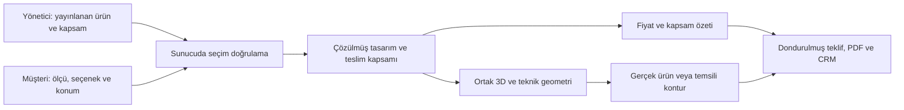

# CS Prefab — De Prefabriek incelemesi ve birleştirilmiş geliştirme yol haritası

13 Eylül 2026, Europe/Amsterdam. **Uygulama öncesi araştırma ve görüşme taslağıdır.** Başlangıç revizyonu `f3da26e`, uygulama sürümü `1.1.0`. Bu belge [12 Eylül durum raporunu](status-review-2026-09-12.md), yeni referans incelemesini ve kullanıcının dahil/hariç aksesuar gereksinimini birleştirir. Uygulama kodu veya çalışan Odoo/Coolify ortamı bu araştırmada değiştirilmedi.

**Hedef:** Gerçek ölçülerle değişen yapıyı hem dışarıdan hem içeriden inceletebilen; seçilen ürün/hizmet ile yalnız fikir vermek için gösterilen aksesuarı ayıran premium bir konfigüratör. Yönetici ürünlerin teslim ve fiyat kurallarını tanımlar. Müşterinin seçimlerinden geçerli tasarım, teslim kapsamı ve fiyat sunucuda türetilir.

**Başlangıçta koruyacağımız altyapı:** Ortak Python doğrulama/fiyat servisleri, Three.js geometrisi, 2D çizimler, cihazda kayıt/paylaşım, tekrar gönderimde tek kayıt, değişmez teklif, CRM ve iki PDF üretim yolu. Son doğrulamada JS 35/35, yerel tarayıcı 18/18 ve 15 axe taraması başarılıydı. Windows/Python 3.13.5 üzerinde 49 testte 12 SQLite temizleme hatası kaydedildi; bunlar çözülmüş değildir. Odoo kanıtı 19.3'e aittir; 19.4 runtime henüz doğrulanmadı. Bu araştırma sırasında bu testler yeniden çalıştırılmadı.

19.4 için önceki raporda kaynakla doğrulanan üç uyumsuzluk: `saas~19.3` manifest öneki, eski `ir.rule`/`ir.model.access` güvenlik tanımları ve `request.website` kullanımı. Bunlar hedef sunucunun gerçek revizyonu doğrulandıktan sonra uyarlanıp kurulum, yetki ve website testleriyle kontrol edilecek. Bugünkü fiyat kitabı demonstrasyon amaçlıdır. Ölçü aralıkları ayrı ayrı doğrulansa da bazı dar doğrama birleşimleri üretilebilir değildir; örneğin 150 cm yapıdaki dört panelli sürgü 15 cm panellere düşüyor. Premium görüntüye geçiş bu ürün kuralı açığını da kapatmalı.

**Önceki rapora eklenen somut anlam hataları:**

- [documents.py](../addons/cs_prefab_configurator/services/documents.py), satır 22, `demolition` alanını mevcut ek yapının yıkımı olarak adlandırıyor. Katalogdaki anlamı ise mevcut arka cephede açıklık oluşturmak. Etiket ve kapsam aynı anlama getirilmeli.
- Aynı dosyada `heating` doğrudan radyatör olarak adlandırılmış; katalogdaki mevcut anlam boş tesisat hazırlığı. Ürün teslimiyle karıştırılmamalı.
- [preview.js](../addons/cs_prefab_configurator/static/src/preview.js), yerden ısıtma seçildiğinde borular çiziyor; katalog açıklaması zeminin hazırlanması/alçaltılması ve bağlantının hariç olması. Hazırlık ile kurulmuş sistem farklı gösterilmeli.
- [pricing.py](../addons/cs_prefab_configurator/services/pricing.py) sıfır tutarlı satırları eliyor. Yeni kapsam listesinde gövde bedeline dahil, ek ücreti sıfır olan ürün/hizmetler yine görünmeli.

**Referans nasıl incelendi?** [De Prefabriek konfigüratörü](https://deprefabriek.nl/configurator/) normal Chromium tarayıcıda açıldı. Dış/iç seçenekler, koşullu alt seçenekler, saha soruları ve teklif öncesi iletişim formu incelendi. Başvuru gönderilmedi. Herkese açık ürün tanımı, tarayıcının normal yüklediği HTTP 200 JavaScript yanıtından alındı; JSON bölümü kod çalıştırılmadan ayrıştırıldı. Kaynakta 50 katman, 45 içerik grubu ve 53 koşul var; bunlar müşteri soru sayıları değildir. Gizli resim yardımcıları ve hesap/form alanları da içerir. Alan/opsiyon/koşul kimlikleri [araştırma kataloğunda](../research/deprefabriek/catalogue.json); tarayıcı kanıtları [araştırma klasöründedir](../research/deprefabriek/browser/). Kaynaktan okunan bir seçenek, tek başına tarayıcıda tıklanmış veya bütün birleşimlerde geçerli kabul edilmedi.

Gerçek etkileşimde **22 katmanda 132 seçenek düğmesi ve 20 grup başlığı** tıklandı; ayrıca saha bölümündeki dört erişim/cephe açıklığı seçimi denendi. Tam dört aşamalı yol, iç alt seçeneklerin kaldırıldığı yol ve 390×844 mobil dış/iç/özet yolu tamamlandı. Genel `1012` posta kodu girilerek taşıma hesaplaması gözlendi; iletişim alanları doldurulmadı. Tüm seçenek birleşimleri, fiziksel telefon/Safari, referansın erişilebilirliği veya performansı test edilmedi. Dört JavaScript hata olayı ana yolları engellemedi; nedenleri teşhis edilmedi. Woonserre yalnız giriş/varsayılan görünüm kapsamında incelendi. Ayrıntı: [doğrulama özeti](../research/deprefabriek/browser/verification-summary.json).

**Görsel açıdan alınacak ders:** Referansta yapı ekranın büyük bölümünü kaplıyor; gün ışığı, doğrama ayrıntısı, iç hacim, döşeme ve çevre düzeni ölçek hissi veriyor. İncelenen sürüm, dış/iç için hazırlanmış JPG/PNG katmanları kullanıyor. 450×200 cm'den 1500×400 cm'ye geçişte görsel dosyaları, resim CSS'i ve görüntü boyutları değişmedi; görüntüleyicide canvas bulunmadı. Bu gözlem, mevcut sunumun ölçüye göre değişen 3D geometri olmadığını doğruluyor. Bizdeki hedef, bu sunum kalitesine yaklaşırken ölçü ve yerleşimleri gerçek geometriyle değiştirmek. Referansın görselleri veya uygulama kodu üretim varlığı olarak kullanılmayacak. [Dış görünüm kanıtı](../research/deprefabriek/browser/01-aanbouw-desktop.png), [iç görünüm kanıtı](../research/deprefabriek/browser/12-interior-full-options.png), [ölçü deneyi](../research/deprefabriek/browser/dimensions-observations.json).

Mobil referansta ilk ekranda görsel, ölçü alanları, toplam ve devam kontrolü erişilebilir; 390 px genişlikte yatay taşma görülmedi. Bizde ilk ölçü alanının ekranın altında kalmasıyla somut bir fark oluşturuyor. Turuncu vurgu, pazarlama şeritleri ve katmanlı kontrol kutuları bizim marka yönümüz için ayrıca değerlendirilmeli; önerim daha sakin bir arayüzde yapıya ve malzemeye daha çok alan ayırmak. [Mobil kanıt](../research/deprefabriek/browser/43-mobile-fresh-outside.png).

**Mevcut ürünle başlıca farklar:** Aşağıdaki sayılar ana Aanbouw ürününün halka açık tanımına aittir. `L` referanstaki layerId'dir. Yeni sınırlar ve ürün türleri bizim tedarik/üretim verimizle doğrulanarak yayınlanmalıdır.

| Alan | Referansta gözlenen yapı | Bizdeki durum ve planlanan karşılık |
| --- | --- | --- |
| Akış | Ürün başlangıcından sonra dış, iç, özet, teklif olmak üzere 4 ana aşama | 7 bölümün içeriğini koruyup daha az ana aşama ve bağlamsal alt gruplara toplamak |
| Ürün ailesi | Başlangıçta Aanbouw / Woonserre ayrımı | İlk ürün Aanbouw; Woonserre için ayrı şablon/yan duvar/çatı kuralları. Aynı ürünü farklı isimle sunmamak |
| Ölçüler, L3 | Genişlik 200–1500, derinlik 150–400 cm | Bizde 150–750 / 100–340 cm. Geniş yapı sınırları açıklık/çatı/üretim kurallarıyla birlikte yönetilecek |
| Cephe, L4 | 12 seçenek; tuğla, PVC kaplama ve ahşap aileleri; ahşap türü/yönü belirtiliyor | Bizde 13 düz seçenek. Aile/tür/yön/renk ayrımı; dış sıva gibi mevcut farklı seçeneklerin korunması işletme kararı |
| Doğrama, L6 | PVC/alüminyum/ahşap altında 26 seçenek; tip, renk ve astarlı yüzey ayrımı | Bizde 11 tip/renk birleşimi, malzeme belirsiz. Tip + malzeme + renk + yüzey işlemi ayrı veriler olacak |
| Rollaag, L5 | Var/yok; seçilen cepheye bağlı görsel malzeme | Bizde varlık ve beyaz/siyah panel aynı seçimde. Rollaag ve üst bitiş profili anlamları ayrılacak |
| Işıklık, L7 | Yok dahil 11 seçenek; tek eğimli 1–5, beşik 2/4/6/8/10 bölüm | Bizde 8 seçenek. Yeni tipler izin verilen açıklık ölçüleriyle genişletilecek |
| Işıklık güneşliği, L19 | Ayrı, koşullu seçenek | Yeni özellik; her ışıklıkla uyumlu sayılmayacak |
| Yeşil çatı, L8 | Sedum seçeneği | Yeni özellik; çatı kapasitesi, kenar ve drenajıyla birlikte modellenecek |
| Çatı kenarı, L9 | Alüminyum, siyah alüminyum, çinko profil | Bizde iki seçenek. Profil geometrisi ve renk ayrılacak |
| Saçak, L10/L20 | PVC/ahşap saçak, bağlı 0–6 spot ve kontrol türü | Yeni özellik; saçak kaldırılınca bağlı seçim, fiyat ve görseller temizlenecek |
| Dış priz, L12 | Tekli/ikili; sol, sağ veya iki taraf | Bizde tek taraf seçimi. Priz tipi, adet ve konum ayrı tanımlanacak |
| Musluk, L13 | İki taraf seçeneği de var | Konum/adet genişleyecek; ürünün teslimi yönetici kapsamına bağlı olacak |
| Yağmur inişi, L14 | PVC, çinko, siyah PVC; tek/iki taraf | Malzeme, renk ve iniş sayısı ayrılacak |
| İç yüzey, L22/L23 | Sıvasız plaka/sıva; sıvaya bağlı boya; sonradan metrajlandırılan iş bilgisi | Boya eklenecek. Ham plaka, sıva, astar ve son kat aynı beyaz yüzey gibi gösterilmeyecek |
| Isıtma, L24/L25 | Radyatör ve yerden ısıtma ürünleri | Bizdeki hazırlık anlamları korunup ürün/kurulum/bağlantı kapsamından ayrılacak |
| Tavan ışığı, L26 | Sol/orta/sağ çoklu konum seçimi | Bizde 0–2 adet. Konum listesi esas olacak, adet bu listeden türetilecek |
| Spot, L28 | Üç sırada 15 ayrı konum; ışıklıkla ilişkili kısıtlar | Bizde 0–12 adet ve otomatik dizilim. Geçerli konumlar tavan geometrisinden üretilecek |
| Duvar ışığı/priz, L30/L32 | Kaynakta iki duvarda üçer konum; iki radyatör seçiliyken tarayıcıda dörder konum erişilebilir | Duvar ışığı yeni; priz için tek yan bayrağı yerine konumlu elemanlar |
| Aydınlatma kontrolü | Anahtarlı/kısılabilir; kontrolün sol/sağ tarafı | Armatür modeliyle karıştırılmadan devre/kontrol seçimi olarak tanımlanacak |
| Saha ve teklif | Arka erişim, cephe açıklığı, posta koduna bağlı taşıma; sonra iletişim formu | Mevcut saha bilgileri korunacak. Taşıma tarifesi ve gereken iletişim alanları bizim operasyonumuza göre düzenlenecek |

Referansın [teknik açıklamaları](https://deprefabriek.nl/specificaties/) bazı elektrik elemanları ve tesisat bağlantılarının kendi teslim kapsamlarında olduğunu, radyatör/yerden ısıtmanın ürün ve bağlantı olarak sağlanabildiğini söylüyor. Buna karşılık konfigüratördeki duvar lambalarının armatürleri kapsam dışında belirtilmiş. Dolayısıyla aynı isimli seçeneğin iki şirkette aynı ticari anlama geldiği varsayılamaz. Referans fiyatları, metrajları, garantileri veya montaj vaatleri bizim fiyat/kapsam tanımımız değildir.

**Önemli koşulların yorumu:** Referansın kuralları iş ihtiyacını gösterir; bizdeki uygulama kendi geometrisini esas almalıdır.

- Sıva kapatıldığında boya seçeneği ve özet karşılığı kayboluyor (K22); sıva yeniden açıldığında önceki boya tercihi geri geliyor. Bu, referansta gizli tercih saklandığını gösteriyor. Bizde etkin kapsam/fiyat hesabında geçersiz seçim kalmamalı; önceki tercihi hatırlamak istenirse bu, etkin seçimden ayrı tutulmalı.
- Saçak varsa saçak spotu, spot varsa kontrol türü açılıyor (K36/K39).
- Sol/sağ radyatör bazı aynı taraf duvar lambası ve priz konumlarını kapatıyor (K34/K35). Bizde bu ilişki nesnenin gerçek yerleşim alanından türetilmeli.
- Işıklıklar belirli spot konumlarını kapatıyor (K37/K38). Her ışıklık bütün tavan noktalarını kapatmamalı.
- Işıklık varsa orta sarkıt tamamen yasak değil: beşik çatı için farklı bağlantı görseli kullanılıyor; en büyük ışıklıklar sol/sağ noktaları sınırlıyor (K40–K52).
- Kaynaktaki güneşlik kuralı yalnız 1/2/3 bölmeli tek eğimli ışıklıklarda görünürlük tanımlıyor (K20). Uyumlu ürün listesi ayrı veridir.

Bizdeki `piles`, `screed`, dış sıva ve tüm iç mekânı kapatma tercihlerinin bu kaynaktaki doğrudan eşleniği bulunmadı. Bunlar otomatik silinmeyecek. Kazık sayısı müşterinin statik tasarım kararı gibi sunulmayacak; ürün/saha verisine bağlı ön değerlendirme olarak ele alınacak.

**Tedarik kapsamı için önerilen temel model:** Bir “dahil” kutusu bütün anlamları taşıyamaz. Her seçenekte hazırlık, ürün teslimi, montaj ve mevcut sisteme bağlantı ayrı bileşenler olmalıdır. Her bileşen `kapsam dışında`, `gövde bedeline dahil` veya `ek ücretli` olabilir. Sonradan metrajlandırılacak işler ayrıca tahmini/inceleme gerektiren olarak işaretlenir; kesin toplamın parçasıymış gibi gösterilmez.

Kullanıcının başlangıç kuralı: musluk, radyatör, lamba, spot, priz ve anahtar gibi son cihazlar şu an **ürün olarak kapsam dışında**; uygun seçimlerde temsili gösterilebilir. Hazırlık ücretleri bu yüzden otomatik sıfırlanmaz. Mevcut açıklamanın doğruladığı hazırlıklar eşlenir; musluk/spot gibi belirsiz demo kalemlerinin anlamı yönetim taslağında ayrıca tanımlanır.

| Durum | 3D anlatımı | Ticari sonuç |
| --- | --- | --- |
| Müşteri seçmemiş | Nesne yok | Ücret veya teslim satırı yok |
| Hazırlık dahil, cihaz hariç | Gerçek hazırlık noktası; isteğe bağlı örnek cihaz konturu | Hazırlık kapsamı/ücreti korunur; cihaz teslim edilmez |
| Cihaz ek ücretle dahil | Gerçek malzemeli cihaz | Ürün satırı ücretlidir; montaj ve bağlantı ayrı okunur |
| Cihaz gövde bedeline dahil | Gerçek malzemeli cihaz | Ek ücreti sıfır olsa da teslim listesinde görünür |
| Dahil cihazın modeli henüz örnek | Gerçek malzemeli genel model ve örnek model etiketi | Dahil olmak, görseldeki marka/modelin kesinleştiği anlamına gelmez |
| Örnekleri gizleme / asset yüklenememesi | Görünüm değişir veya açıklamalı yedek gösterim | Fiyat, miktar ve teslim kapsamı değişmez |

Radyatör örneğinde özet “sol duvar radyatör konumu”, ücret satırı “radyatör tesisat hazırlığı”, kapsam “hazırlık dahil; radyatör/montaj/bağlantı hariç” diyebilir. Genel bir feragat cümlesi yeterli değildir: kısa durum seçenek kartında, seçilen nesnede, özette ve PDF görsel açıklamasında tutarlı görünmelidir.

**Önerilen görsel ayrım:** Dahil ürün gerçek hacim ve malzemeyle; hariç örnek ise temiz mimari kontur, hafif mat dolgu ve gerektiğinde ince taramayla gösterilsin. Kontur sahne derinliğine uysun, duvar arkasından görünmesin. Rastgele karakalem gürültüsü, üçgen wireframe veya tamamen saydam cam hissi kullanılmasın. Bu, kullanıcının siluet fikrinin mimari sunuma uyarlanmış önerisidir.

`Inbegrepen`, `Ter illustratie · niet inbegrepen` ve gerektiğinde `Inbegrepen · model indicatief` gibi kısa metinler renge ek olarak kullanılabilir. Bütün nesnelerde sürekli balon göstermek yerine küçük bir açıklama anahtarı ve seçili nesne etiketi yeterli olur. Hariç örnek lamba varsayılan olarak gerçek armatür gibi ışık yaymaz; ışık etkisini inceleme ayrı, açıkça adlandırılmış bir görünüm işlemi olabilir.

**Yönetici ekranında önerilen yapı:**

| Yönetim alanı | Yönetici neyi tanımlar? |
| --- | --- |
| Katalog yayını | Şirket/site, sürüm, para birimi, demo/onaylı fiyat durumu, taslak/yayın/önceki sürüm |
| Ürün ailesi ve seçenek | Gövde/aksesuar/saha işi, uygun ürün türü, müşteri etiketi, varsayılan seçim, boyut/adet/konum sınırı |
| Kapsam bileşenleri | Hazırlık, ürün, montaj, bağlantı; dahil/hariç/ek ücret; miktar ve fiyat dayanağı |
| Görsel eşlemesi | Onaylı model kütüphanesindeki varlık, ölçüsü, bağlantı yüzeyi, revizyonu, örnek/kesin model durumu |
| Bağımlılıklar | Uygun saçak/ışıklık/doğrama birleşimleri, izin verilen konumlar, çakışma/temizleme kuralları |
| Yayın önizlemesi | Örnek müşteri konfigürasyonunda 3D, fiyat, kapsam ve PDF etkisini birlikte inceleme |

Asgari Odoo modelleri `cs.prefab.catalog.release`, `cs.prefab.catalog.option`, `cs.prefab.catalog.component` olabilir. Sınırlı miktar türleri kullanılmalı: sabit, adet, m², konum sayısı ve açık paket bedeli. Mevcut iki taraf paketleri her zaman iki tekli fiyatın toplamı değildir. Yönetici serbest Python/SQL çalıştıran bir kural editörüne ihtiyaç duymamalı.

Yayınlanmış katalog değişmez; düzeltme yeni taslak/yayın olarak yapılır. Tek istek boyunca doğrulama, fiyat, etiket ve kapsam aynı yayın sürümünü kullanır. Şu anki sabit JSON okuması ortak bir katalog sağlayıcısına dönüşür; yerel uygulama JSON, Odoo kendi yayınlanan kaydı üzerinden aynı sözleşmeyi sağlar.

Yeni kayıt, katalog ve model revizyonlarını, çözülmüş kapsam bileşenlerini, fiyatları ve görsel açıklamalarını dondurur. Eski kayıtlar yeni kurallarla yeniden yorumlanmaz. Siyah doğrama antrasite; malzemesi belirtilmemiş eski doğrama PVC/alüminyuma sessizce çevrilmez. Açık müşteri oturumunda yayın değişirse yeni kapsam/fiyat gösterilir; daha önce kaydedilmiş aynı başvurunun tekrarı ise orijinal teklifi döndürür.

**Dinamik 3D için hedef kapsam:**

- Parametrik gövde, duvar açıklıkları, çatı/ışıklık/saçak ve kaplama gerçek ölçülerle değişir. Radyatör veya musluğun kendisi yapı genişlediğinde esnemez; uygun konumu yeniden çözülür.
- Tek ortak modelden dış perspektif, içeride göz hizası, üstten kesit, plan/cephe ve tavan görünümü üretilir. Çatı kaldırmak tavan lambalarını havada bırakmamalı; tavan yüzeyi, çatının dış kabuğu ve armatürler ayrı yönetilir.
- Bahçe cephesi, mevcut ev tarafı ve yan duvarların kimliği sabittir. Kamera dönünce sol/sağ seçimin fiziksel duvarı değişmez.
- İlk sürümde geçerli montaj bölgeleri ve konum noktaları önerilir. Daha sonra bu bölgeler içinde taşıma eklenebilir. Işıklık, kapı açılımı, radyatör ve priz çakışması sahne ile sunucuda aynı kurallarla değerlendirilir.
- Malzeme setleri fiziksel ölçekte renk, yüzey normali ve pürüz haritaları içerir. Cam/metal yansımaları, derzler, eşikler, profiller ve çatı birleşimleri hedef kalitenin parçasıdır.
- Üretim kapsamı dışındaki mobilya/bitki/yaşam sahnesi ayrı örnek dekor katmanıdır. Cihaz yerleşimlerini veya teknik ölçüleri örtemez; kapatılabilir.
- Seçili elemana gitme kamera kontrolü olur. Kullanıcının elle ayarladığı kamera her küçük seçimde zorla sıfırlanmaz.

Teknoloji önerisi: mevcut Three.js tabanı korunabilir; gövde parametrik, detaylı aksesuarlar ölçülü GLB/glTF kütüphanesinden yüklenebilir. Gerekli varlıklar kademeli yüklenir; tekrarlanan parçalar paylaşılır/instancing kullanılır; sıkıştırılmış dokular ve cihaz kalite kademeleri değerlendirilir. Her değişiklikte bütün sahneyi yeniden kurmak yerine ilgili parça güncellenir. [GLTFLoader](https://threejs.org/docs/pages/GLTFLoader.html), [KTX2Loader](https://threejs.org/docs/pages/KTX2Loader.html), [InstancedMesh](https://threejs.org/docs/pages/InstancedMesh.html). Bunlar performans sonucu değil, uygulama önerileridir; kullanılan 0.180.0 sürümünün ilgili API'si geliştirmede ayrıca kontrol edilecektir.

**Müşteri akışı için öneri:** Dört ana aşama; her aşamada kısa, bağlama göre açılan alt gruplar.

| Aşama | İçerik ve görünüm |
| --- | --- |
| 1. Yapı ve dış cephe | Ürün tipi, ölçüler, cephe, doğrama, çatı/ışıklık/saçak, dış elemanlar; dış görünüm |
| 2. İç mekân | Yüzeyler, ısıtma, tavan/duvar elektrik noktaları, cihaz örnekleri; iç/tavan/kesit görünümü |
| 3. Saha ve teslim kapsamı | Mevcut ev bağlantısı, erişim, temel ön değerlendirmesi, taşıma bölgesi, dahil/hariçlerin kontrolü |
| 4. Özet ve teklif | Tasarım karşılaştırması, fiyat/kapsam, kaydet/paylaş ve iletişim talebi |

Masaüstünde model ekranın büyük bölümünü kaplar. Mobilde kompakt sahne ile açılıp kapanan seçenek paneli birlikte erişilebilir olur; ayrıca tam ekran inceleme bulunur. Şu an ilk ölçü girdisinin mobilde 994. pikselde başlaması giderilecek. Tasarım kaydı, kişisel bilgi istenen teklif/iletişim işlemiyle aynı eylem gibi adlandırılmayacak. Mevcut iç mekânı yapılandırmama seçeneği korunabilir; yalnız aşamayı gezmemek önceki seçimleri silmez.

**Uygulama sırası ve kabul ölçütleri:**

| Faz | İş | Tamamlanma kanıtı |
| --- | --- | --- |
| 1 — Temel ve veri anlamı | 19.4 manifest/güvenlik/website uyarlaması; Windows SQLite bağlantı yaşam döngüsü; doğru ürün/kapsam etiketleri; katalog sürümü ve üretilebilir seçim sözleşmesi | Yerel testler başarılı; eski kayıt eşlemesi açık; kullanıcı fiyat/kapsam enjekte edemiyor. 19.4 runtime kabulü hedef hazır olduğunda tamamlanır |
| 2 — Tek örnekte kalite standardı | Bir tipik yapıda kaliteli dış + iç + tavan görünümü; bir radyatörün dahil/örnek/hazırlık durumları; yönetici seçiminin fiyat/PDF'ye kadar izlenmesi | Aynı ölçü ve kapsam tüm çıktılarda; kontur ayrımı anlaşılır; dar/normal/geniş yapı cihazları esnetmiyor |
| 3 — Genişleyen katalog ve yönetim | Malzeme/tip/renk, yeni çatı/saçak/boya/tesisat seçenekleri; konumlar; yayın ekranları ve bağımlılıklar | Seçim iptalinde bağlı fiyat/nesneler temizleniyor; geçersiz birleşimler sunucuda reddediliyor; yeni yayın eski teklifi değiştirmiyor |
| 4 — Tam deneyim | Dört aşama, mobil panel, göz hizası/kesit/tavan, sahneden seçim, örnek aksesuar anahtarı | Telefon ilk ekranında anlamlı işlem; görünüm değişimi fiyatı etkilemiyor; klavye/2D fallback; gerçek telefon ve masaüstü kontrolü |
| 5 — Teklif ve operasyon | Kapsam tablosu, yerel PDF + Odoo QWeb, CRM özeti, gerçek fiyat/taşıma/ekip ayarları | İki PDF motoru aynı kapsamı taşıyor; sıfır ek ücretli dahil ürün listede; eski/görselsiz kayıtlar çalışıyor; tekrar başvuru tek kayıt |
| 6 — Coolify üzerinde kabul | Sağlanan saas~19.4 test hedefinde kurulum/güncelleme, yetkiler, proxy, PDF motoru ve çoklu worker denemeleri; performans ölçümü | Sürüm/commit kaydı, şirket/site ayrımı, gerçek CRM/PDF testleri, sınırlı test verisi, geri dönüşün doğrulanması |

Faz 2'nin ince örneği, görsel standardın tüm kataloğa yayılmasından önce değerlendirilir. Böylece premium hedef, yalnız renk/font kararına bırakılmaz. Woonserre ayrı ürün ailesi olarak aynı veri yapısına bağlanabilir; ilk sürüme dahil edilip edilmeyeceği, yan duvar/çatı/tedarik kapsamı netleşince kararlaştırılır. İlk referans kalitesi Aanbouw üzerinde kurulması önerilir.

**Kritik kabul senaryoları:**

1. Hazırlık ücretli, cihaz hariç: yalnız hazırlık hesaplanır; cihaz örnek konturdur; PDF ve CRM aynısını söyler.
2. Cihaz gövdeye dahil, ek ücret sıfır: cihaz teslim listesinde kalır. Montaj ve bağlantı ayrıca doğrulanır.
3. Örnekleri gizlemek, kamera değiştirmek veya varlığın yüklenememesi ticari konfigürasyonu değiştirmez.
4. Saçak kaldırma, sıvayı kapatma, ışıklık/radyatör ekleme geçersiz alt seçimleri bildirerek temizler; eski ücret kalmaz.
5. Dar/geniş ölçüde doğrama/ışıklık/aksesuar çakışmaları önlenir; tavan ve iç görünümde kopuk/havada eleman oluşmaz.
6. Fiyat ile gönderim arasında katalog yayınlanırsa sessiz değişiklik olmaz. Kaydedilmiş başvurunun tekrarı yine eski kayda döner.
7. Eski/yeni/görselsiz teklif, yerel PDF ve QWeb ayrı doğrulanır; dahil/hariç açıklamaları görsel yanında da bulunur.
8. Satışçı/yönetici, şirket/site, public erişim ve çoklu worker senaryoları 19.4 üzerinde çalışır.

Performans bütçesi ilk kalite örneğinde gerçek cihazlarla belirlenecek. Başlangıç kabul önerisi: seçilen orta sınıf test telefonunda normal model etkileşiminde en az 30 FPS; yalnız yerleşim/malzeme değiştirmede gereksiz sahne yeniden yüklemesi olmaması; render kaybında çalışan 2D; art arda seçimlerde sürekli büyüyen GPU belleği olmaması. Bu değerler ölçülmüş mevcut sonuçlar değildir.

**Coolify çalışma sınırı:** İlk araştırma sırasında kullanıcı Odoo 19.4 kurulumunu ve `api.key` bilgilerini hazırlıyordu; o araştırmada uzak bağlantı kurulmadı. Kullanıcının bilgileri eklediğini bildirmesinden sonra, 13 Eylül'de salt okunur hedef kontrolü tamamlandı: gerçek sürüm **saas~19.4**, Coolify/Odoo/SSH erişimi başarılı, kalıcı addon dizini boş ve PDF aracı/font mevcut. Ayrıntılar ve henüz test edilmemiş alanlar [hedef kontrol raporunda](odoo-19.4-target-check-2026-09-13.md). Modül kurulmadı ve servis değiştirilmedi. Uygulama denemeleri belirlenmiş test uygulaması/veritabanında sahte verilerle yürütülecek; mevcut verili hedefte değişiklik gerekiyorsa DB/filestore yedeği ve geri dönüş yöntemi somut olarak doğrulanacak. Anahtar içeriği rapora, test çıktısına veya Git'e girmeyecek. Üretim yayını bu araştırmanın kapsamı değildir.

**Görüşmeye sunduğum ekler ve kararlar:**

- Dört aşamalı akış ve mimari kontur yaklaşımını başlangıç tasarım yönü olarak öneriyorum.
- İki tasarımı karşılaştırma ve kısa değişiklik özeti, çok sayıda seçenek arasında karar vermeyi kolaylaştırır; ilk temel tamamlandıktan sonra eklenebilir.
- Malzeme yakın görünümü ile dahil/hariç filtresi, sahneyi daha fazla dekorla doldurmadan kaliteyi ve anlaşılabilirliği artırır.
- İlk yerleşim sistemi izinli montaj noktaları/bölgeleri olsun; bölgeler içinde sürükleme sonraki geliştirme olabilir.
- Woonserre'nin ilk sürüme girip girmeyeceği, aksesuarların gerçek tedarik kapsamları/model verileri ve gerçek fiyat/metraj politikası açık ürün kararlarıdır. Referans bunları bizim adımıza belirlemez.
- Mülk değer artışı/kredi tahmini gibi referanstaki ek pazarlama araçları ayrı veri ve operasyon gerektirir; çekirdek 3D/kapsam geliştirmesinden sonra değerlendirilmesi önerilir.

Araştırma kanıtlarının saklandığı [README](../research/deprefabriek/README.md), tıklanan yollar ile yalnız kaynaktan tespit edilen seçeneklerin ayrımını ve erişim sınırlamalarını açıklar. Nihai uygulama kapsamı, bu plan üzerine kullanıcının geri bildirimiyle kesinleştirilecektir.
