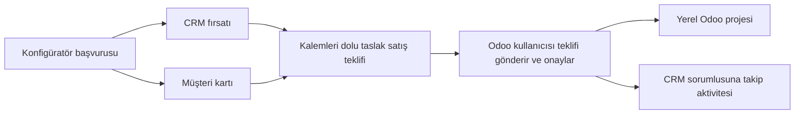

# Prefab 2.2 — yerel Odoo iş akışı

Kullanıcının 13 Eylül 2026 seçimleri:

1. Başvuruda müşteri kartı, CRM fırsatı ve kalemleri dolu taslak satış teklifi otomatik oluşur. Teklif gönderimi kullanıcının işlemidir.
2. Odoo satış teklifi onaylanınca proje otomatik oluşur. CRM aşaması değiştirilmez; sorumlu kullanıcıya aşamayı değerlendirme aktivitesi açılır.

Katalog, ham JSON yerine seçenek, açıklama, varsayılan, fiyat ve ölçü alanlarıyla düzenlenir. Yayındaki katalog için yeni taslak oluşturulur; eski teklifin içeriği değiştirilmez. Başvuru ekranında gönderilen iletişim bilgileri, seçimler, görseller ve EUR tutarlar okunur alanlarda gösterilir. İşlem yapılacak müşteri, CRM, satış teklifi ve projeye doğrudan ulaşılır.

İlk müşteri gönderimi kayıt olarak korunur. Müşteri kartındaki iletişim bilgileri ve taslak satış teklifindeki ürün, miktar, birim, fiyat, vergi ve koşullar yerel Odoo ekranlarından düzenlenir. Sonraki ticari düzenleme, gönderim anındaki konfigüratör fiyatını geriye dönük değiştirmez.

Mükerrer gönderim yeni müşteri/fırsat/teklif oluşturmaz. Tekrar onay aynı proje ve aktiviteyi çoğaltmaz. Daha önce gönderilmiş başvurular ve varsa bunlara bağlı boş taslak teklifler, mevcut ticari verilerin üzerine yazılmadan tamamlanır. Kaydedilmiş ve düzenlenmiş satış satırları yeniden hesaplanmaz.

Santimetre ölçülerinin alanı dört ondalık basamak içerebilir: 501 × 299 cm = 14,9799 m². Yerel Odoo **Product Unit** hassasiyeti en az 4 basamağa çıkarılır; daha yüksek mevcut ayar düşürülmez. Bu paylaşılan ayar diğer yerel miktar alanlarının gösterimini de etkiler; kayıtlı miktarlar yeniden hesaplanmaz. Satışta m², adet ve sabit iş için **Post** birimleri kullanılır.

Vergi için şirketin uygun satış vergisi esas alınır. Yeni katalog oranına karşılık gelen yerel vergi henüz tanımlı değilse müşteri başvurusu kaybolmaz; yöneticiye eksik ayar ve tekrar satış teklifi oluşturma eylemi gösterilir. Sistem farklı bir vergiyi sessizce kullanmaz.

Hedef [prefabpartner.codesnap.nl/prefab](https://prefabpartner.codesnap.nl/prefab), gerçek sürüm `saas~19.4`. `saas~19.4.2.2.0` güncellemesi 13 Eylül 2026 tarihinde uygulandı. Aynı Odoo görüntüsü ve izole geri yüklenmiş veritabanında **23/23 Odoo testi**, bağımsız Python servislerinde **94/94 test** geçti. Proje oluşturma, CRM aşamasını koruma, tamamlanmış aktiviteyi tekrar oluşturmama, düzenlenmiş satış satırlarını koruma, katalog düzenleme ve JPEG eklerinin gerçek içeriği test edildi.

Ana hedefteki 1 eski başvuru, 1 dolu yerel satış teklifine bağlandı; eksik işlem kalmadı. Başvurunun dondurulmuş verileri değişmedi. Müşteriye e-posta gönderilmedi, satış teklifi onaylanmadı. Yayında 345 dosyanın SHA-256 değeri test edilmiş paketle eşleşti. DB, filestore ve addon yedekleriyle birlikte sonuçlar [dağıtım kanıtında](verification/2.2/deployment.json) tutulur. Tarayıcı kabul sonucu [ayrı raporda](verification/2.2/native-browser.json) kaydedilir.
