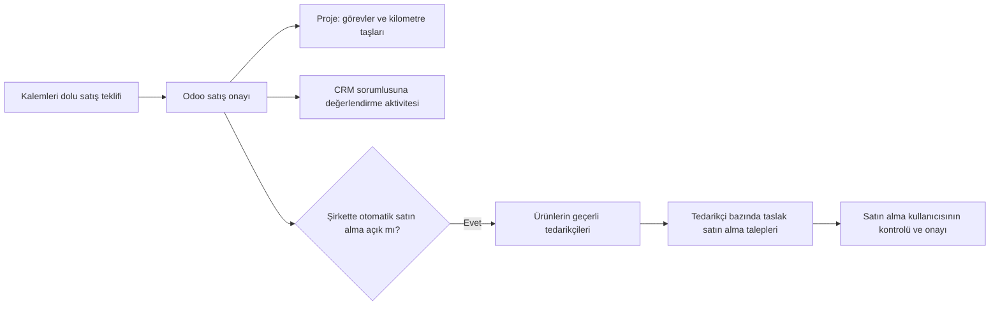

# Prefab 2.5 — Odoo proje ve satın alma iş akışı

Bu belge 2.5 değişikliklerinin kullanımını ve sınırlarını açıklar. Canlıya kurulum durumunu belirtmez; test ve dağıtım sonuçları [2.5 doğrulama klasöründe](verification/2.5/) ayrıca kaydedilir. Önceki müşteri–CRM–satış akışı [2.2 belgesinde](native-odoo-workflow-2.2.md) açıklanmıştır.

Konfigüratör başvurusunda müşteri, CRM fırsatı ve kalemleri dolu taslak satış teklifi oluşur. Satış teklifinin Odoo'da onaylanması, uygulama projesinin görev planını ve şirket ayarı açıksa taslak satın alma taleplerini hazırlar. CRM aşaması aynı kalır; sorumluya aşamayı değerlendirme aktivitesi açılır.

## Şirket ayarları

Sistem yöneticisi **Prefab → Uitvoering en inkoop** ekranını açar. Ayarlar etkin şirkete aittir.

| Alan / işlem | Kullanımı |
| --- | --- |
| **Prefab-projectsjabloon** | Odoo'nun yerel proje şablonu. Görevler, kilometre taşları ve bağımlılıklar bu şablonda düzenlenir. Şablon aynı şirkete ait veya paylaşılan olmalıdır. |
| **Inkoopaanvragen bij verkoopbevestiging** | Satış onayında taslak satın alma taleplerinin hazırlanmasını açar. Kapatmak mevcut talepleri silmez. Proje planı bundan bağımsızdır. |
| **Inkoopverantwoordelijke** | Oluşan satın alma talebini kontrol edecek kullanıcı. Aktif şirket ve satın alma yetkileri dikkate alınır. |
| **Leverancier voor nieuwe prefabproducten** | Yeni oluşturulan prefab ürünlerinin ilk tedarikçi kurulumu için kullanılır. Önceden düzenlenmiş ürün tedarikçilerini değiştirmez. |
| **Voorbeeldinrichting toepassen** | Örnek tedarikçiyi ve düzenlenebilir standart proje şablonunu hazırlar. Mevcut prefab ürünlerinin ilk tedarikçi kurulumunu yapar ve otomatik satın almayı açar (onay penceresiyle). Mevcut tedarikçi fiyatlarını değiştirmez. Aynı adlı örnek tedarikçi zaten varsa yenisini oluşturmaz, onu kullanır. |

Örnek kurulumdaki tedarikçi **Prefab voorbeeldleverancier** adını taşır ve e-posta adresi yoktur. Satın alma fiyatı bilinmeyen ilk tedarikçi satırı **0** fiyatla oluşturulur. Bu değer satın alma maliyeti tahmini değildir; kontrol edilmesi gereken eksik fiyatı görünür tutar.

## Proje planını kullanmak

Satış onayında Odoo'nun satışa bağlı projesi kullanılır. Plan yalnızca bir kez eklenir. Projedeki **Prefab-werkplan** sekmesinden satış orderine, kullanılan şablona ve kilometre taşlarına ulaşılır; **Taken en kolommen bewerken** düğmesi yerel görev ekranını açar.

Kanban sütunları işin durumunu gösterir: **Te doen**, **In uitvoering**, **Wacht op informatie**, **Afgerond**. Mevcut projede eşdeğer sütunlar varsa bunların kimlikleri, adları ve ayarları korunur. Örneğin **In behandeling** ve **Voltooid** sütunları yeniden oluşturulmaz. Mevcut iptal veya özel sütunlar kaldırılmaz. Görevin tamamlanması Odoo'nun yerel görev durumu üzerinden yönetilir.

Uygulama aşamaları yerel **mijlpalen** kayıtlarıyla ayrılır:

| Kilometre taşı | Standart görevler |
| --- | --- |
| **Opname en maatvoering** | Yerinde inceleme; kesin ölçülerin, mevcut bina bağlantısının ve teknik koşulların kontrolü. |
| **Ontwerp goedgekeurd** | Uygulama çizimlerinin ve teslim kapsamının hazırlanması; tasarım ve uygulama anlaşmalarının onayı. |
| **Inkoop en productie gereed** | Tedarikçi ve sipariş kontrolü; üretim hazırlığı ve prefabrik gövdenin sevke hazırlanması. |
| **Bouwplaats gereed** | Şantiye erişimi, temel bağlantısı, kotlar ve teslim kapsamındaki hazırlıkların kontrolü. |
| **Montage en aansluitingen gereed** | Nakliye, vinç ve montaj tarihinin koordinasyonu; gövdenin yerleştirilmesi ve bağlantıların kontrolü. |
| **Oplevering afgerond** | Son kontrol ve eksik işlerin takibi; teslim kabulü ve devir dosyası. |

Standart şablonda **11 görev** bulunur. Önce keşif ve ölçüm, ardından tasarım onayı; sonrasında tedarik, üretim ve saha hazırlığı; devamında teslimat, montaj ve son kontrol bağımlılıkları tanımlıdır. Mevcut projede elle kurulmuş bağımlılık veya bekleme düzenini değiştirecek bir özellik açılışı gerekiyorsa bu düzen korunur.

Onaylanan satışın pozitif miktarlı **hazırlık, montaj ve bağlantı** satırları ayrıca ilgili kilometre taşına görev olarak eklenir. Karar güncel satış satırlarına göre verilir. Taslak tekliften çıkarılan satır görev oluşturmaz. Yalnızca temsili gösterilen bir radyatör ya da kapsam dışında kalan armatür, ürünü veya montajını teslim edilecekmiş gibi bir görev üretmez. Bir ürünün teslim edilmesi de tek başına montaj veya bağlantının dahil olduğu anlamına gelmez.

Görevlerde kaynak satış orderi ve varsa ilk başvuru bağlantısı bulunur. Kapsamdan üretilen görev ayrıca ilgili satış satırına bağlıdır. İlk konfigürasyon özeti korunur; son ticari anlaşmanın kaynağı onaylanan satış orderidir. Şablondaki geçerli sorumlular korunur; atanmamış görevlerde şirket için geçerli satış sorumlusu kullanılır. Görüşülmemiş teslim tarihleri veya son tarihler uydurulmaz.

## Şablonu düzenlemek ve mevcut işi korumak

Şirket ekranından **Prefab-projectsjabloon** kaydını açarak yerel Odoo görevlerini ve kilometre taşlarını düzenleyebilirsin. Kendi kontrol görevlerini, alt görevlerini ve bağımlılıklarını eklemek mümkündür. Kilometre taşındaki **Prefab-planningsfase** alanı otomatik eklenen teslim kapsamı görevlerinin hangi aşamaya yerleşeceğini belirler; görünen ad serbestçe değiştirilebilir.

Şablondaki görev ve kilometre taşı değişiklikleri bundan sonra oluşturulacak planlarda kullanılır. Önceden oluşturulmuş görevler, sorumlular, son tarihler ve tamamlanmış işler yeniden doldurulmaz. Odoo görev sütunları paylaşılan yerel kayıtlardır: aynı sütunu kullanan şablon ve projelerde sütun adını değiştirmek tüm bağlı projelerde görünür. Mevcut projeye özel bir durum gerektiğinde ayrı bir sütun kullanılmalıdır.

Tekrar onay, iptalden sonra yeniden onay veya aynı hazırlık işleminin tekrarı, planı çoğaltmaz. Kullanıcının tamamladığı, arşivlediği veya sildiği görevler geri oluşturulmaz. Başlangıçta projede bulunan elle girilmiş görevler ve sütunlar korunur. Modül yükseltmesi projelere kendiliğinden şablon veya görev eklemez; eski onaylı bir projenin tamamlanması ayrıca belirlenmiş kurulum işlemiyle yapılır.

## Satın alma taleplerini kullanmak

Kurulum mevcut prefab ürünlerini bir defa hazırlar. Sonraki satış onayında pozitif miktarlı ürün/hizmet satırları, ürünün **Inkoop / Purchase** seçeneği açıksa ve geçerli tedarikçisi bulunuyorsa satın almaya alınır. Notlar, bölüm başlıkları, avanslar ve gider satırları buna dahil edilmez.

Her satış orderi için tedarikçi, şirket ve para birimine göre **taslak RFQ / offerteaanvraag** oluşur. Aynı tedarikçiden alınan uygun satırlar aynı günün taslak talebinde toplanır. Başka satış orderlerinin talepleriyle birleştirilmez. Tedarikçi, ürünün **en üstteki geçerli tedarikçi satırıdır** (sıra/sequence). Geçerlilik tarihi ve asgari miktar dikkate alınır. Fiyatı 0 olan örnek tedarikçi satırı, başka bir geçerli tedarikçi varsa ona yol verir. Miktar, birim dönüşümü ve fiyatlandırma Odoo'nun yerel mekanizmasını kullanır. Satın alma talebinde kaynak satış ve proje bağlantıları bulunur. Dahili kontrol notu talebin sohbet (chatter) geçmişine yazılır. Tedarikçiye görünen şartlar alanı boş bırakılır.

Tüm prefab ürünlerinin tedarikçi satırlarını **Prefab → Leveranciers van prefabproducten** listesinde tedarikçiye göre gruplu görebilirsin (Inkoop: Beheerder rolü). Buradan fiyat değiştirebilir veya satır silebilirsin. Başka bir tedarikçi eklemek için ürünü açıp **Inkoop** sekmesini kullan (Productbeheer rolü). Tedarikçi, fiyat, birim, asgari miktar ve geçerlilik tarihleri sonraki talebin seçimini etkiler. Satış fiyatı satın alma fiyatı olarak kopyalanmaz. Kurulumdan önce onaylanmış orderler (ör. S00001) otomatik talep almaz; gerekirse o orderde düğmeyle tamamlanır.

- Ürünü otomatik satın almadan çıkarmak için üründeki **Inkoop / Purchase** seçeneğini kapat.
- Ürünün bütün geçerli tedarikçilerini kaldırmak da o ürünün otomatik satın alınmasını durdurur. Başka uygun tedarikçi varsa o seçilir. Kullanıcının kaldırdığı tedarikçi satırları örnek kurulum tekrarlanınca geri eklenmez. **Dikkat:** Odoo, bir satın alma orderi onaylandığında o orderin tedarikçisini ürüne kendisi ekler. Bir tedarikçiyi kaldırmadan önce ona ait açık talepleri iptal et veya tedarikçisini değiştir.
- Geçerli tedarikçisi olmayan uygun satır atlanır; satış orderindeki **Prefab-inkoop** sekmesinde kontrol notu ve sorumluya tek bir açık aktivite oluşturulur. Satın almaya hiç hazırlanmamış bir prefab ürünü de ayrıca belirtilir; bilerek "Inkoop" kapatılmış ürün sessizce atlanır.
- Satın alma adımındaki beklenmeyen bir hata satış onayını engellemez. Satış onaylanır, proje oluşur ve sekmede tamamlama düğmesini kullanma notu görünür.
- Nul fiyat içeren talepte uyarı görünür. Satın alma kullanıcısı gerçek fiyatı, miktarı, birimi ve teslim tarihini inceleyip kendisi onaylar. Otomasyon talebi tedarikçiye göndermez veya satın alma orderini onaylamaz.
- Eksik tedarikçi bilgisi tamamlandığında, onaylı satışta **Ontbrekende inkoopaanvragen aanvullen** düğmesi henüz işlenmemiş satırları tamamlar. Bu işlem satın alma yetkisi gerektirir.

Oluşmuş satın alma satırları kullanıcıya aittir. Tekrar çalıştırma mevcut satırları çoğaltmaz veya değiştirilen fiyatları geri almaz. Silinen satın alma satırı otomatik olarak geri oluşturulmaz. İşlenmiş satış satırının ürünü, birimi veya miktarı sonradan değişirse (iptal → teklif → düzenleme → yeniden onay yolu dahil), eski ve yeni değerler satış orderinin sohbet geçmişine not olarak yazılır ve sorumlunun açık kontrol aktivitesine eklenir. Otomasyon mevcut RFQ'yu sessizce yeniden yazmaz. İşlenmiş bir satış satırı silinirse ilgili satın alma talebinde aktivite açılır. Onaydan sonra eklenen veya miktarı 0'dan pozitife çıkan satırlar bildirilir ve düğmeyle satın almaya eklenir.

## Uygulama ve doğrulama kaynakları

Kaynak kodu: [proje planı](../addons/cs_prefab_configurator/models/project_workflow.py), [satın alma](../addons/cs_prefab_configurator/models/purchase_workflow.py), [yerel satış onayı](../addons/cs_prefab_configurator/models/native_sales.py). Proje kabul senaryoları [ORM test dosyasında](../addons/cs_prefab_configurator/tests/test_project_workflow.py) yer alır. Gerçek saas~19.4 kaynakları incelenerek yerel proje şablonu, görev, kilometre taşı ve satın alma yardımcıları kullanılmıştır. Çalıştırılmış test sayısı ve canlı kurulum sonucu, ilgili doğrulama kanıtı oluştuğunda raporlanır.
