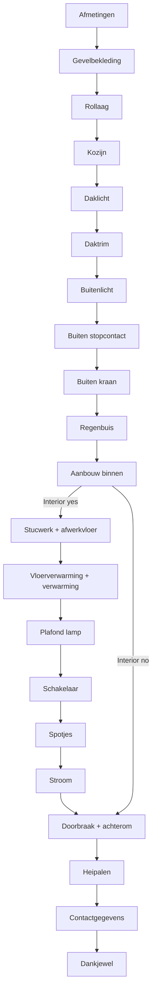

# Prefab Partner reference configurator audit

Audited 2026-09-09. Scope: public page, public runtime, public configurator definition, all configurable choice labels and two branch paths. No lead was sent and no contact details were entered. Browser research explicitly aborts every request whose method is not GET, HEAD or OPTIONS. The form's blank-field validation can therefore be examined safely.

## Outcome and evidence boundary

The exact configurator behind [Prefab Partner's quote page](https://prefabpartner.nl/offerte/) was recovered and traversed, despite the wrapper's script service not loading in this environment. It is an externally hosted **Reuzenpanda 2.0 question flow with conditional image layers**, not a dimensional 3D building configurator. Its full interior branch comprises **20 input pages followed by a thank-you page**. The short branch skips six interior pages and reaches contact on page 14. There are **33 questions, 94 answer options, 21 page definitions, 18 image layers, 97 layer variants and 83 unique referenced image URLs**.

These counts describe the fetched public definition, not commercial availability guaranteed by Prefab Partner. The schema has leftover image conditions and duplicated graph relations; the usable path was verified in a real Chromium browser rather than inferred from array ordering alone.

The reference is a **quote request flow**. It does not expose an instant price, a price formula or a price book in the fetched definition. `style.priceIndicator` is `none`. Its last page says the quote is emailed within 24 hours. A rebuild must not describe invented prices as the original provider's prices.

## Primary sources and local evidence

- Wrapper page: https://prefabpartner.nl/offerte/
- Public definition: https://backend.reuzenpanda.nl/widget-service/api/v1/configurators/28befe23-1200-4d1c-8092-e48a83477820/new
- Working hosted flow: https://directsamenstellen.nl/28befe23-1200-4d1c-8092-e48a83477820
- Reuzenpanda API documentation: https://api.reuzenpanda.app/
- Hosting/integration explanation: https://docs.reuzenpanda.app/google-tag-manager/technical
- Vendor product page: https://prefabpartner.nl/oplossingen/prefab-aanbouw/
- Vendor home/process page: https://prefabpartner.nl/

The full sanitized response is `research/reference/configurator-definition.json`; a compact field catalogue is `research/reference/catalogue.json`; named image conditions are in `research/reference/image-layer-map.json`. `walkthrough.json` captures the full yes-interior browser path and `walk-01.png` through `walk-19.png` show every subsequent input page. Initial views are `initial-desktop.png` (the wrapper) and `standalone-initial.png` (the recovered flow). Caller IP information was removed from the saved definition response.

## How the embedded application is loaded

The public site is WordPress with Divi 4.27.8. It loads Figtree for the wrapper, Rank Math schema, a WhatsApp plugin and Divi assets. An inline script dynamically appends:

`https://snippet.reuzenpanda.nl/api/snippet/v1/js/eafd3f85-8c43-4848-b025-10448270c067/prefabpartner.nl`

The target element has a fixed initial height of 700 px and `data-rp-configurator-id="28befe23-1200-4d1c-8092-e48a83477820"`. The first browser visit showed a blank reserved block and no iframe after 15 seconds. Direct requests to the snippet also hung/timed out. This establishes a failure **from the audit environment**, not a universal provider outage. Public backend and standalone pages returned 200 and worked.

The hosted form uses Next.js/React assets, CSS module class names, Poppins 16 px, square white controls and orange `#e9521c` primary buttons. Its desktop composition is `HORIZONTAL_RIGHT`: preview on the left, narrow scrollable questions on the right, fixed heading, black/gray progress bar, arrow-only back button, and an orange `Volgende` button. The source default minimum slider positions are visible while corresponding required number fields start empty.

`advancedSettings` enables automation and analytics, sets Dutch, hides close controls, and sets the cookie-banner mode to `NONE`. Display settings disable the provider branding and action button. The root field `show` is false even though the hosted flow works; do not interpret this isolated field as proven public disablement.

## Actual step graph

The array lists Rollaag near the end and calls the plaster/floor page `Pagina 20`; relations determine their actual positions. The conditional interior edge matches answer `c59cda51-fddb-4bfc-b083-1344508e8e2c` on question `0a385dba-66ab-4729-9b8d-1b4f478d6154`. It leads to the interior finishing page. The fallback leads directly to structural work. The definition also contains repeated unconditional edges for Heipalen→Contactgegevens and Aanbouw binnen→Doorbraak; these should be deduplicated in a clean implementation.

## Exact question and option catalogue

All product questions are mandatory, including explicit none/no choices. Only the contact note is optional. All selectable fields are single-choice RADIO definitions rendered as buttons with visual radio marks.

| Page | Field | Type | Required | Choices or constraints |
|---|---|---|---|---|
| Afmetingen | Breedte | NUMBER | Yes | 150–750 cm; step 1 |
| Afmetingen | Diepte | NUMBER | Yes | 100–340 cm; step 1 |
| Gevelbekleding | Baksteen steenstrips | RADIO | Yes | Baksteen rood; Baksteen zwart; Baksteen wit; Baksteen geel; Hout horizontaal; Hout verticaal; Opengevel verticaal; Opengevel horizontaal; Kunststof zwart; Kunststof groen; Kunststof creme wit; Kunststof antraciet; Buitenstuc |
| Rollaag | Rollaag | RADIO | Yes | Rollaag; Geen rollaag wit; Geen rollaag zwart |
| Kozijn | Kozijn | RADIO | Yes | Geen deur; Openslaande deur zwart; Openslaande deur wit; Openslaande deur met roedes zwart; Openslaande deur met roedes wit; 2-delige schuifpui zwart; 2-delige schuifpui wit; 4-delige schuifpui zwart; 4-delige schuifpui wit; Harmonicapui zwart; Harmonicapui wit |
| Daklicht | Lessenaars dakramen | RADIO | Yes | Nee; 1 vaks lessenaar; 2 vaks lessenaar; 3 vaks lessenaar; 4 vaks lessenaar; 4 vaks zadeldak; 6 vaks zadeldak; 8 vaks zadeldak |
| Daktrim | Daktrim | RADIO | Yes | Daktrim aluminium; Daktrim aluminium antraciet |
| Buitenlicht | Buitenlicht | RADIO | Yes | Geen; Links; Rechts; Beide kanten |
| Buiten stopcontact | Buiten stopcontact | RADIO | Yes | Geen; Links; Rechts |
| Buiten kraan | Buiten kraan | RADIO | Yes | Geen; Links; Rechts |
| Regenbuis | Regenbuis materiaal | RADIO | Yes | PVC; Zink |
| Regenbuis | Plaatsing | RADIO | Yes | Links; Rechts |
| Aanbouw binnen | Aanbouw binnen | RADIO | Yes | Stel aanbouw binnenzijde samen; Dit is niet nodig |
| Binnenafwerking (internal name Pagina 20) | Wel of geen stucwerk | RADIO | Yes | Geen stucwerk; Wel stucwerk |
| Binnenafwerking (internal name Pagina 20) | Wel of geen afwerkvloer | RADIO | Yes | Geen afwerkvloer; Wel een afwerkvloer |
| Vloerafwerking | Vloerverwarming | RADIO | Yes | Geen; Vloerverwarming |
| Vloerafwerking | Verwarming | RADIO | Yes | Geen; Links; Rechts; Beide kanten |
| Plafond lamp | Plafond lamp | RADIO | Yes | Geen; 1 plafond lamp; 2 plafond lampen |
| Schakelaar | Schakelaar | RADIO | Yes | Geen; 1 schakelaar; 2 schakelaars |
| Aantal spotjes | Aantal spotjes | RADIO | Yes | Geen; 1 spotje; 2 spotjes; 3 spotjes; 4 spotjes; 5 spotjes; 6 spotjes; 7 spotjes; 8 spotjes; 9 spotjes; 10 spotjes; 11 spotjes; 12 spotjes |
| Stroom | Stopcontact | RADIO | Yes | Geen; Links; Rechts; Beide Kanten |
| Doorbraak maken | Geveldoorbraak | RADIO | Yes | Geen doorbraak; Met doorbraak |
| Doorbraak maken | Is er een achterom aanwezig | RADIO | Yes | Nee; Ja |
| Heipalen | Aantal heipalen | RADIO | Yes | 2 heipalen; 3 heipalen; 4 heipalen; 6 heipalen |
| Contactgegevens | Voornaam | TEXT | Yes | Voornaam |
| Contactgegevens | Achternaam | TEXT | Yes | Achternaam |
| Contactgegevens | E-mailadres | TEXT | Yes | E-mailadres |
| Contactgegevens | Telefoonnummer | TEXT | Yes | Vul hier jouw antwoord in |
| Contactgegevens | Adresgegevens | TEXT | Yes | Straatnaam |
| Contactgegevens | Huisnummer | TEXT | Yes | Huisnummer |
| Contactgegevens | Postcode | TEXT | Yes | Postcode |
| Contactgegevens | Woonplaats | TEXT | Yes | Woonplaats |
| Contactgegevens | Opmerking toevoegen | TEXT_AREA | No | Vul hier jouw antwoord in |

## Scope notes that affect a quote

- The façade palette is a set of main colors; exact possibilities are discussed after issuing the quote.
- The brick soldier course option means masonry continues above the frame. Without it, the panel is white or black to match the frame.
- All non-none rooflight choices are described as fixed clear glazing. Rooflight shape and panel count are separate in concept but combined in the reference's choices.
- Exterior light and exterior socket requests are **empty conduits**. They do not promise complete connected electrical installations.
- The interior radiator/heating side, switch and socket options also state empty-conduit scope.
- Ceiling-light count denotes prepared power points; the provider says it does not install the ceiling lights themselves.
- Underfloor heating means lowering the floor to accommodate it; connection to existing heating is explicitly excluded in the source wording.
- Rainwater downpipe PVC is marked standard; zinc is the alternative. Material and side are distinct questions.
- Structural work separates opening the existing exterior wall from availability of rear access.
- The user selects pile count. The source's guidance is fewer than 10 m²: 2; 10–15 m²: 3; 15–25 m²: 4; 25–40 m²: 6. Threshold equality is not defined, there is no soil/structural calculation, and this is not an engineering design. A rebuild should record a provisional selection and require project-specific review.
- Maximum dimensions permit 25.5 m² (7.5 × 3.4 m), so most of the stated 25–40 m² pile band is outside the form's dimension range.

## Preview model and limitations

The exterior begins from a photoreal perspective showing the extension against an existing house, garden paving/plants, a flat roof, brick façade and a dark glazed opening. Source image URLs come from `user-info.reuzenpanda.nl/widget-service/product-templates/configurators/...`. Different options select transparent/composited PNG layers. The form reuses exterior layers via `headingImageLink` through exterior decisions and the contact page. Interior decisions use a second seven-layer image composition, and the structural/piles pages also reuse the interior preview.

The exterior composition declares 11 layers: base/context, façade, frame, another context layer, soldier course/panel, rooflight, roof trim, exterior lighting, exterior socket, tap, and downpipe location. Interior composition declares seven layers for the room and interior choices. A named variant map is saved locally for traceability; the production implementation should own its own drawing/assets rather than depend on the remote provider's URLs.

Width/depth fields have no image-layer conditions. The reference illustrates options, but does not supply actual parametric geometry, orbit controls, camera views, dimensional positioning, structure/foundation modeling, collision validation, BOM quantities, or proof of manufactured proportions. This is a useful point of improvement for the CS module: derive preview and pricing from one normalized configuration, show dimensions and a clearly schematic model, and keep the perspective consistent when options change.

There are stale conditions referencing two questions that do not exist and eleven answer IDs absent from the active catalogue. The frame imagery declares 13 variants while the UI has 11 options. Internal `name` metadata for some spot-count choices is wrong (8 spots named 7, later names reduced to single characters); visible `text` is correct. Do not turn stale internal display strings into canonical keys.

## Validation and accessibility observations

Observed in real Chromium:

- Blank dimensions block progress via native required validation.
- Entering width 100 and depth 500 displays lower/upper-bound error messages and keeps the page unchanged.
- Width accepts the stated 150–750 cm interval; depth 100–340 cm; increments are integer centimeters.
- The numeric fields do not declare native min/max attributes; bounds are implemented separately. Sliders declare min/max/step.
- Sliders and numeric inputs have `aria-label="undefined: undefined"`, while slider `aria-valuetext` incorrectly appends degrees Celsius. A rebuild must use real Dutch field labels and cm units.
- Radio choices are actual `button` elements with decorative marks, not native radios or elements with radio roles in the inspected DOM. Keyboard button activation exists, but radio-group semantics/state are absent.
- Contact fields are defined with technical types for first/last name, email, phone, street, house number, postcode, and city. Source field names are mostly blank and rely on placeholders. Persistent labels are preferable.
- No consent checkbox or privacy-link question appears in the 33-question schema. A local module should make its own contact-processing purpose clear and avoid claiming a fabricated legal checkbox from the reference.

## Exhaustive choice coverage

A second desktop browser pass clicked **all 94 source answer options**. Every clicked option acquired the provider's selected CSS state. The pass reached contact after all 20 input pages and recorded zero horizontal overflows at 1500 × 1000 px. The separate no-interior mobile pass reached contact after 14 input pages, also without horizontal overflow. This verifies catalogue reachability and branch navigation; it does not certify engineering compatibility of every combination or screenshot equality of all 94 rendered image variants.

Evidence: `research/reference/desktop-all-observations.json`, `research/reference/mobile-skip-observations.json` and `research/reference/verification-summary.json`. Incidental analytics query identifiers were stripped from the saved network endpoint records.

## Mobile and state behavior

The 390 × 844 px standalone flow was traversed through the no-interior branch to contact (14 input pages including dimensions). Every visited page had document width exactly 390 px; no horizontal overflow was observed. Mobile layout moves the preview above the questions, keeps back/next controls at the bottom, and uses an internal scroll region for long option lists. The preview may initially be blank while the image assets load; later option screenshots show the loaded image. Do not equate an early screenshot before image completion with a rendering defect.

Choosing `Dit is niet nodig` skips all six interior pages and goes straight from Aanbouw binnen to Geveldoorbraak. On desktop, going back from façade to dimensions preserved `500` and `300`, and returning preserved the façade radio selection. Browser storage contains persisted configuration/funnel state in sessionStorage; durable cross-session recovery was not claimed from this observation.

Contact required flags exist in the schema but native DOM input `required` attributes were false in the inspected contact form. The form uses custom validation. Blank submit remained at contact, and all non-read requests were blocked throughout research. Delivery, automation, email content and server-side validation are intentionally unverified.

## Recommended implementation interpretation

Preserve the complete field catalogue, centimeter ranges, interior branch, explicit none choices, exterior/interior scene modes, previous/next navigation, quote summary and lead handoff. Group compatible questions into clear sections if that reduces fatigue; maintain each original choice in the normalized configuration. Use stable semantic identifiers, not source UUIDs or display labels. Keep the user's previous selections when navigating, remove excluded interior scope from quote calculations, and revalidate the full configuration on the server.

Add durable local configuration persistence, share/export, an editable review step before contact, honest price-book status, responsive previews, keyboard/label support, and a quote request reference. Price inputs must be explicitly owned sample rates until a verified business price book is available. Manufacturing constraints, foundations, delivery/crane access, permits and structural calculations belong in a review queue until supported by real business data.

Do not reproduce the source's empty embed failure, ambiguous engineering promise, incorrect slider units, stale image mappings, duplicate relations, unlabelled contact inputs or made-up instant prices.
